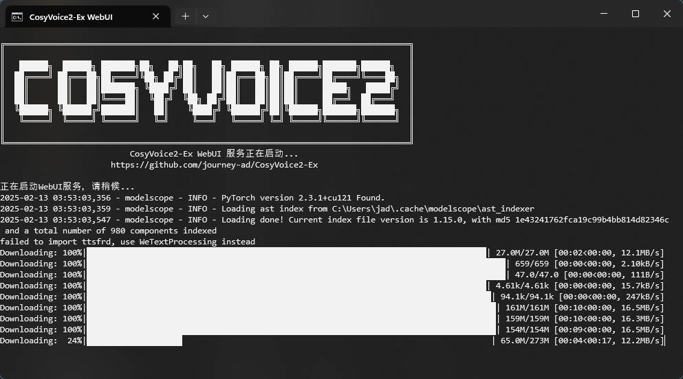

<p align="center">
  <a href="https://github.com/Akshay090/svg-banners" target="_blank">
    
  </a>
</p>
<p align="center">
  <a href="https://count.getloli.com" target="_blank">
    
  </a>
</p>

# CosyVoice2-Ex
CosyVoice2 功能扩充（预训练音色/3s极速复刻/自然语言控制/自动识别/音色保存/API），支持 Windows / Linux / MacOS

Demo: [Modelscope](https://www.modelscope.cn/studios/journey0ad/CosyVoice2-Ex)

## 启动

> [!NOTE]
> 首次运行会自动下载约 10G 左右的模型文件，也可以[自行下载模型文件](https://www.modelscope.cn/models/iic/CosyVoice2-0.5B)，放置于 `pretrained_models` 目录下

### Windows

提供有 Windows 可用的一键包，解压后双击打开 `运行-CosyVoice2-Ex.bat` 即可运行

[>>> 点击下载 <<<](https://github.com/journey-ad/CosyVoice2-Ex/releases/latest)

<p>
  
</p>

### Linux & macOS

在 MacBook Pro(M4 Pro) 和 WSL2 Ubuntu 22.04 部署运行测试通过

须通过 conda 环境运行，参考 https://docs.conda.io/en/latest/miniconda.html

```sh
conda create -n cosyvoice -y python=3.10
conda activate cosyvoice
conda install -y -c conda-forge pynini==2.1.5
pip install -r requirements.txt -i https://mirrors.aliyun.com/pypi/simple/ --trusted-host=mirrors.aliyun.com

python webui.py --port 8080 --open
```

Linux 可安装 `ttsfrd` 提升文本归一化性能（可选）

```sh
sudo apt-get install -y git build-essential curl wget ffmpeg unzip git git-lfs sox libsox-dev nvidia-cuda-toolkit

git lfs install
git clone https://www.modelscope.cn/iic/CosyVoice-ttsfrd.git pretrained_models/CosyVoice-ttsfrd

cd pretrained_models/CosyVoice-ttsfrd/
unzip resource.zip -d .
pip install ttsfrd-0.3.6-cp38-cp38-linux_x86_64.whl
```

## 接口地址

[示例指令](./示例指令.html)
```sh
python api.py

http://localhost:9880/?text=春日清晨，老街深处飘来阵阵豆香。三代传承的手艺，将金黄的豆浆熬制成最纯粹的味道。一碗温热的豆腐脑，不仅是早餐，更是儿时难忘的记忆，是岁月沉淀的生活智慧。&speaker=舌尖上的中国

http://localhost:9880/?text=hello%20hello~%20[breath]%20听得到吗？%20きこえていますか？%20初次见面，请多关照呀！%20这里是嘉然Diana，大家也可以叫我<strong>蒂娜</strong>%20是你们最甜甜甜的小草莓&speaker=嘉然&instruct=慢速，用可爱的语气说
```

## Credits

- [CosyVoice](https://github.com/FunAudioLLM/CosyVoice)
- [CosyVoice_For_Windows](https://github.com/v3ucn/CosyVoice_For_Windows)
- [Fish Audio](https://fish.audio)

## 免责声明

1. 本项目仅用于学习、研究和技术交流目的。使用者必须遵守中华人民共和国相关法律法规，尊重他人知识产权和合法权益。

2. 本项目基于 [Apache 2.0](./LICENSE) 协议开源

3. 关于项目中的音频素材：
   - 项目中包含的示例音频仅用于技术测试和演示目的
   - 音频素材的版权归原作者所有，不适用于本项目遵循的 Apache 2.0 协议
   - 如果您是音频素材的版权所有者且不希望被使用，请联系我们删除

4. 关于 AI 生成语音：
   - 模型生成的语音内容可能存在版权风险
   - 生成的语音可能被用于制作误导性内容
   - 请谨慎使用和传播 AI 生成的语音内容
   - 建议在使用生成的语音内容时注明其 AI 生成的属性

5. 严禁将本项目用于以下用途：
   - 任何违法违规行为
   - 侵犯他人知识产权或其他合法权益
   - 传播不良或有害信息

6. 使用限制：
   - 请勿用于制作违法违规内容
   - 请勿用于制作虚假信息或误导性内容

7. 使用本项目所产生的一切后果由使用者自行承担，项目开发者不承担任何法律责任

8. 如果本项目有任何侵犯您权益的地方，请及时联系我们，我们将立即处理

使用本项目即表示您已阅读并同意以上声明
